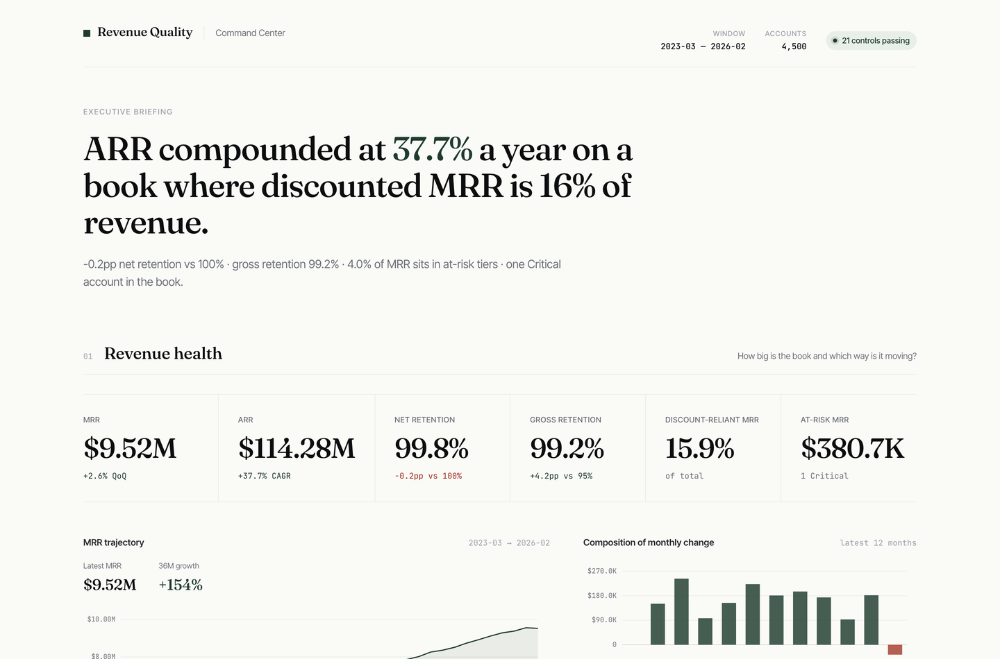

# B2B SaaS Revenue Quality & Churn Early Warning

A reproducible analytics pipeline that interrogates whether B2B SaaS recurring-revenue growth is **durable or discount-financed**, and surfaces the accounts most likely to churn before renewal.

End-to-end: synthetic data generation → feature engineering → rule-based scoring → backtest calibration → scenario forecasting → self-contained executive dashboard, gated by a 21-control formal validation layer.

**Live dashboard:** [revenue-quality-command-center](https://mfidalgomartins.github.io/b2b-saas-revenue-quality-churn-os/)



---

## Why this exists

Topline MRR can grow while revenue quality quietly degrades. By the time logo churn shows up in the board deck, the leading indicators — discount creep, usage decay, payment slippage, fragile expansion — have been visible in the data for months.

This project demonstrates an interpretable, auditable framework for catching that drift early, with every score traceable to the raw field it came from.

## What's inside

| Layer | What it does |
|---|---|
| `src/data_generation/` | Generates 11 raw CSVs (customers, plans, subscriptions, monthly metrics, invoices, …) with seeded RNG. Deterministic for `--seed 42`. |
| `src/features/` | Builds the analytical layer: account-month revenue quality, customer health features, cohort retention summaries, account risk base. Schema-validated at the boundary. |
| `src/scoring/` | Four interpretable 0–100 scores — churn risk, revenue quality, discount dependency, expansion quality — composed into a governance priority. Single source of truth for weights in `scoring_utils.py`. |
| `src/scoring/backtest_scoring_calibration.py` | Reconstructs every historical month's score with the production weights and measures forward-3M churn by tier. Drift between backtest and production is impossible by construction. |
| `src/scoring/run_weight_sensitivity.py` | ±20% weight perturbation report. Quantifies how stable tier assignments are. |
| `src/forecasting/` | MRR scenario trajectories — base, downside, upside, discount-discipline, risk-adjusted. |
| `src/visualization/` + `src/dashboard/` | 15 leadership charts and a self-contained HTML executive command center. |
| `src/validation/` | 21 governance checks (row counts, nulls, duplicates, leakage, calibration monotonicity, …) feeding a publication-readiness gate. |
| `sql/marts/` | SQL mirror of the Python semantic layer for warehouse consumers. |

## Headline results (seed 42)

| Metric | Value |
|---|---|
| Accounts modelled | 4,500 over 36 months |
| Annual run-rate (latest) | $114.3M |
| ARR CAGR over window | 37.7% |
| Net Revenue Retention (NRR) | 99.8% |
| Gross Revenue Retention (GRR) | 99.2% |
| Discount-reliant MRR | 15.9% |
| Backtest forward-3M churn — Low / Moderate / High | 2.3% / 6.2% / 18.1% |
| Weight sensitivity — max tier flips under ±20% perturbation | 5.3% |
| Governance gate | 21 / 21 PASS · readiness `technically valid` |

The 8× lift between Low- and High-tier forward churn is the credibility test for the rule-based scoring approach — a calibration anyone can reproduce by running the pipeline.

## Run it

```bash
pip install -r requirements.txt
python src/pipeline/run_project_pipeline.py --base-dir . --seed 42
```

Stages: `generate → profile → features → score → backtest → sensitivity → analyze → forecast → visualize → dashboard → validate → gate`. ~30 seconds on a modern laptop.

Strict release gate (used in CI):

```bash
python src/validation/check_validation_gate.py \
  --summary-path reports/formal_validation_summary.json \
  --max-warn 0 --max-fail 0 \
  --max-high-severity 0 --max-critical-severity 0 \
  --min-readiness-tier "technically valid"
```

## Decisions this supports

- **Renewal triage** — which accounts need intervention now, ranked by governance priority.
- **Discount discipline** — how much ARR is bought with sub-economic pricing, and where it concentrates.
- **Expansion quality** — separates genuine seat / usage expansion from price-led churn-in-disguise.
- **Forecast realism** — bridges current-state metrics to forward MRR scenarios with explicit assumptions.

## Design choices

- **Rule-based, not ML.** Every score is a weighted sum of normalised components defined in `scoring_utils.py`. Defensible in front of a CFO; no black-box explainability problem.
- **One source of truth for weights.** Production scorer and calibration backtest both import the same `CHURN_WEIGHTS` dict. A unit test asserts weights sum to 1.
- **Schema contracts at load boundaries.** `src/io/contracts.py` rejects malformed inputs before they propagate.
- **Validation gate, not assertions.** 21 governance checks produce a readiness tier; the CLI gate fails CI on any regression in WARN / FAIL counts or severity counts.
- **Self-contained dashboard.** Charts are drawn inline as SVG from the embedded JSON payload. The HTML works offline and on GitHub Pages without a build step.

## Limitations

- Synthetic data by design. The pipeline shape is real; absolute numbers are illustrative.
- Rule-based scores are interpretable but not causal. The backtest measures discrimination, not treatment effect.
- Single-tenant assumption: no multi-product overlap or cross-sell logic modelled.

## Repository layout

```
src/        analysis/  dashboard/  data_generation/  features/  forecasting/
            io/  pipeline/  profiling/  scoring/  validation/  visualization/
data/       raw/  processed/
docs/core/  feature_dictionary.md  methodology.md  scoring_model_design.md  …
outputs/    charts/  dashboard/  preview/
reports/    profiling, business analysis, validation, backtest, sensitivity
sql/        staging/  marts/
tests/      41 unit + contract tests
```

## Tech

Python 3.12 · pandas · NumPy · Matplotlib · Seaborn · SQL · HTML / CSS / SVG / JS · ruff · unittest · GitHub Actions

---

Built by [Miguel Fidalgo Martins](https://www.linkedin.com/in/miguel-fidalgo-martins/).
