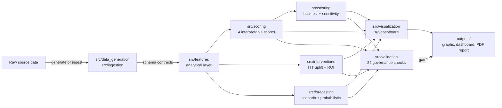

# B2B SaaS Revenue Quality & Churn Early Warning

[](https://github.com/mfidalgomartins/b2b-saas-revenue-quality-churn-os/actions/workflows/qa.yml)
[](LICENSE)
[](pyproject.toml)
[](Makefile)
[](pyproject.toml)
[](Dockerfile)
[](reports/formal_validation_summary.json)

A reproducible Python and SQL analytics system for testing whether B2B SaaS recurring-revenue growth is **durable or discount-financed**, then prioritising accounts with elevated churn risk.

**[Open the live dashboard](https://mfidalgomartins.github.io/b2b-saas-revenue-quality-churn-os/)** · **[Read the report](outputs/reports/revenue_quality_os_consulting_report.pdf)**


---

## Executive summary

Recurring-revenue growth can look healthy on the top line while being financed by discounting, propped up by a handful of accounts, or masking usage decay that precedes churn. This system turns that question into a governed, re-runnable pipeline: it scores every account on four interpretable 0–100 dimensions, backtests those scores against actual forward churn, measures whether a retention intervention is worth scaling, and forecasts MRR with calibrated uncertainty rather than a single point estimate — then blocks publication of any result that fails one of 24 governance checks.

At seed 42, the book is growing at a **37.7% ARR CAGR** with **99.8% NRR**, but **15.9% of MRR is discount-reliant**, the rule-based score shows an **8× gap in forward churn between its Low and High tiers**, and the modeled retention intervention does **not** clear the bar to scale (`do_not_scale`, estimated ROI −103.5%). Every number above is traceable to a documented field or formula and is reproduced identically by CI on every push — see [Headline results](#headline-results-seed-42) for the full table and [Decisions this supports](#decisions-this-supports) for how each output maps to an operating decision.

## Architecture



Every stage reads and writes through the schema contracts in `src/io/contracts.py`, so a malformed upstream table fails fast at the boundary rather than silently propagating into a score, forecast, or chart. The same DAG runs end-to-end via `src.pipeline.run_project_pipeline` and is re-verified by CI on every push.

## Analytical scope

The seeded simulation covers **4,500 accounts across 36 monthly periods from March 2023 to February 2026**. The pipeline runs synthetic data generation, schema validation, feature engineering, interpretable scoring, forward-outcome calibration, scenario forecasting, chart and PDF generation, and a self-contained executive dashboard.

Topline MRR can grow while discount creep, usage decay, payment slippage, and fragile expansion weaken the book. Every score in this repository is traceable to documented fields and formulas so the resulting intervention queue can be audited.

## What's inside

| Layer | What it does |
|---|---|
| `src/ingestion/` | Converts governed CSV extracts into the canonical raw schema with strict contracts, keyed pseudonymization, PII removal, source SLAs, key integrity, and checksummed manifests. |
| `src/data_generation/` | Generates 6 raw CSVs with seeded RNG. Deterministic for `--seed 42`. |
| `src/features/` | Builds the analytical layer: account-month revenue quality, customer health features, cohort retention summaries, account risk base. Schema-validated at the boundary. |
| `src/scoring/` | Four interpretable 0–100 scores — churn risk, revenue quality, discount dependency, expansion quality — composed into a governance priority. Single source of truth for weights **and component formulas** in `scoring_utils.py`. |
| `src/scoring/backtest_scoring_calibration.py` | Reconstructs every historical month's score with the production formulas and measures forward-3M churn by tier. A parity test detects drift against the latest production score. |
| `src/scoring/run_weight_sensitivity.py` | ±20% weight perturbation report. Quantifies how stable tier assignments are. |
| `src/interventions/` | Builds a leakage-safe blocked experiment ledger, attaches forward retention outcomes, checks covariate balance, estimates ITT uplift with bootstrap intervals, and translates it into commercial ROI. |
| `src/forecasting/` | MRR scenario trajectories plus a local-trend residual block bootstrap with P05–P95 intervals and leakage-safe rolling-origin calibration. |
| `src/visualization/` + `src/dashboard/` | 16 presentation-ready graphs and a self-contained HTML dashboard. |
| `scripts/build_pdf_report.py` + `scripts/build_consulting_pdf_report.py` | Build the consulting-grade report from the same processed tables and graph pack — the first script produces the analytical base PDF, which the second reads from disk, verifies is byte-unchanged, and re-typesets into the published consulting report. |
| `src/validation/` | 24 governance checks spanning data integrity, metric reconciliation, leakage, calibration, intervention evidence, forecast uncertainty, provenance, and publication authorization. |
| `sql/marts/` | SQL mirror of the Python semantic layer for warehouse consumers. |

## Headline results (seed 42)

| Metric | Value |
|---|---|
| Accounts modelled | 4,500 over 36 months |
| Annual run-rate (latest) | $114.3M |
| ARR CAGR over window | 37.7% |
| Net Revenue Retention (NRR) | 99.8% |
| Gross Revenue Retention (GRR) | 99.2% |
| Discount-reliant MRR | 15.9% |
| Backtest forward-3M churn — Low / Moderate / High | 2.3% / 6.1% / 18.9% |
| Weight sensitivity — max tier flips under ±20% perturbation | 5.3% |
| Probabilistic forecast — rolling-origin MAPE / P90 coverage | 1.07% / 91.1% |
| Synthetic intervention — gross MRR retention uplift (95% CI) | -0.11% (-1.84% to 1.66%) |
| Synthetic intervention decision | `do_not_scale` · estimated ROI -103.5% |
| Governance gate | 24 / 24 PASS · readiness `technically valid` |

The roughly 8× lift between Low- and High-tier forward churn is the main calibration result for the rule-based score.

## Run it

```bash
python -m venv .venv
source .venv/bin/activate
python -m pip install --require-hashes -r requirements-dev.lock
python -m pip install --no-deps --no-build-isolation -e .
python -m src.pipeline.run_project_pipeline --base-dir . --seed 42
```

Stages: `generate → profile → features → score → backtest → sensitivity → interventions → analyze → scenario forecast → probabilistic forecast → graphs → dashboard → validate → gate → report`.

For confidential source extracts, define a source-owned ingestion contract, run `make ingest INGESTION_CONFIG=/path/to/contract.json`, then start the pipeline with `--skip-data-generation --intervention-ledger /path/to/prospective_assignment.csv --skip-gate`. The adapter is fail-closed; validation blocks public release unless the contract explicitly sets `publication_allowed=true`, and the pipeline refuses retrospective random assignment on real outcomes. See [`docs/core/real_data_ingestion.md`](docs/core/real_data_ingestion.md).

The same governed release can run in a pinned, non-root container:

```bash
docker build --tag revenue-quality-os:local .
docker run --rm revenue-quality-os:local
```

See [`docs/core/container_deployment.md`](docs/core/container_deployment.md) for artifact persistence and supply-chain controls.

Strict release gate (used in CI):

```bash
python -m src.validation.check_validation_gate \
  --summary-path reports/formal_validation_summary.json \
  --max-warn 0 --max-fail 0 \
  --max-high-severity 0 --max-critical-severity 0 \
  --min-readiness-tier "technically valid"
```

## Quality gates

Everything below is enforced by `make qa` and by CI on every push and pull request; CI also reruns weekly so
new dependency advisories surface even when the repository is idle.

| Gate | Command | Bar |
|---|---|---|
| Lint | `make lint` | Ruff `E,F,I,B,UP,SIM,C4`, clean |
| Format | `make format-check` | Ruff formatter, no diff |
| Types | `make typecheck` | mypy (strict-ish) across every production module under `src/`, zero errors |
| Coverage | `make coverage` | **100% branch coverage** of the pure-logic core library (`fail_under = 100`) |
| Static security | `make security` | Bandit, no findings (subprocess/`git` patterns reviewed and documented) |
| Dependency audit | `make audit` | `pip-audit`, no known CVEs in declared dependencies |
| Governance gate | `make gate` | 0 WARN / 0 FAIL / 0 high / 0 critical, `technically valid` |

CI additionally installs the SHA-256-locked dependency closure, rebuilds the full pipeline from seed,
rebuilds the PDF a second time to enforce byte-reproducible publication output, and builds/smoke-tests the
pinned non-root container.

One check is manual, not gated — `make benchmark` runs the backtest hotspot benchmark
(see [`docs/core/performance.md`](docs/core/performance.md)) but isn't wired into `qa` or CI, since it
reports a number to track over time rather than a pass/fail bar.

Coverage is measured over the pure-logic modules unit tests import directly (`metrics`, `scoring_utils`,
`io/*`, the validation gate, `dashboard_contract`); mypy covers all of `src/`, and the end-to-end pipeline
scripts are exercised by the integration build (`make all`) and the artifact-contract suite. See
[`CONTRIBUTING.md`](CONTRIBUTING.md) for the full workflow and [`SECURITY.md`](SECURITY.md) for the security posture.

## Decisions this supports

- **Renewal triage** — which accounts need intervention now, ranked by governance priority.
- **Intervention governance** — whether an outreach programme has retention evidence and positive commercial ROI strong enough to scale.
- **Discount discipline** — how much ARR is bought with sub-economic pricing, and where it concentrates.
- **Expansion quality** — separates genuine seat / usage expansion from price-led churn-in-disguise.
- **Forecast realism** — bridges current-state metrics to forward MRR scenarios with explicit assumptions.
- **Forecast uncertainty** — distinguishes the median path from empirically calibrated operating ranges and exposes horizon-specific error and coverage.

## Design choices

- **Rule-based, not ML.** Every score is a weighted sum of normalised components defined in `scoring_utils.py`.
- **One source of truth for scoring math.** All four score families compose from `compute_*_components` functions and weight dicts in `scoring_utils.py`; the production scorer and calibration backtest import the same definitions, so they cannot drift. Unit tests assert weights sum to 1 and pin each component family.
- **Schema contracts at load boundaries.** `src/io/contracts.py` rejects malformed inputs before they propagate; the optional real-data adapter adds source SLAs, referential integrity, PII removal, keyed pseudonymization, and checksummed ingestion manifests.
- **Beginning-base retention.** GRR, NRR, revenue churn, and logo churn exclude new logos and use reconstructed beginning-of-month denominators.
- **Validation gate.** 24 governance checks produce a readiness tier; the CLI gate fails CI on any regression in WARN / FAIL counts, severity, source provenance, or publication authorization.
- **Self-contained dashboard.** Charts are drawn inline as SVG from the embedded JSON payload. The HTML works offline and on GitHub Pages without a build step.

## Limitations

- Synthetic data by design. The pipeline shape is real; absolute numbers are illustrative.
- Rule-based scores are interpretable but not causal. Calibration uses the same synthetic data-generating environment and is not external validation.
- The intervention module demonstrates randomized ITT measurement on synthetic outcomes; it does not establish real-world treatment effectiveness.
- Scenario forecasts are assumption-driven operating cases. Probabilistic intervals use only 36 monthly observations, so tail and structural-break evidence remains limited.
- Churn-event months remain part of monthly revenue exposure; retention metrics explicitly remove churned MRR from the retained base.
- Single-tenant assumption: no multi-product overlap or cross-sell logic modelled.

## Roadmap

Ordered by what would most change the system's real-world decision-grade, not by effort:

1. **Causal uplift, not ITT-only.** The intervention module currently reports randomized intent-to-treat effects on synthetic outcomes; a real deployment would add CUPED variance reduction and heterogeneous treatment-effect segmentation once genuine assignment logs exist.
2. **Multi-product and cross-sell modeling.** Scoring and forecasting currently assume single-tenant, single-product accounts; multi-product overlap would change how expansion quality and discount dependency are computed.
3. **Additional real-data source adapters.** `src/ingestion/` ships a governed CSV adapter; a warehouse-native adapter (e.g., reading directly from a Snowflake/BigQuery mart via `sql/marts/`) would remove the CSV hand-off for teams already on a warehouse.
4. **Longer probabilistic-forecast history.** The rolling-origin calibration is honest about its limits with 36 monthly observations; more history would let the P05–P95 band capture genuine tail and structural-break risk rather than in-sample variance.
5. **BI-tool sink.** The dashboard and SQL marts are designed to be portable; a native Looker/Power BI/Metabase semantic-layer binding is the natural next integration point for teams that already standardize there.

## Repository layout

```
src/        analysis/  dashboard/  data_generation/  features/  forecasting/
            ingestion/  interventions/  io/  pipeline/  profiling/  scoring/
            validation/  visualization/
data/       raw/  processed/     (raw/ is generated, not tracked — see data/README.md)
docs/core/  feature_dictionary.md  methodology.md  scoring_model_design.md  …
outputs/    graphs/  dashboard/  reports/
reports/    profiling, business analysis, validation, backtest, sensitivity
sql/        staging/  marts/
tests/      unit, metric-integrity, and artifact-contract tests
```

## Tech

Python 3.12.13 · pandas · NumPy · Matplotlib · Seaborn · ReportLab · DuckDB · SQL · HTML / CSS / SVG / JS · Ruff · mypy · unittest · coverage.py · Bandit · pip-audit · Docker · GitHub Actions

Released under the [MIT License](LICENSE).

---

Built by [Miguel Fidalgo Martins](https://www.linkedin.com/in/miguel-fidalgo-martins/).
