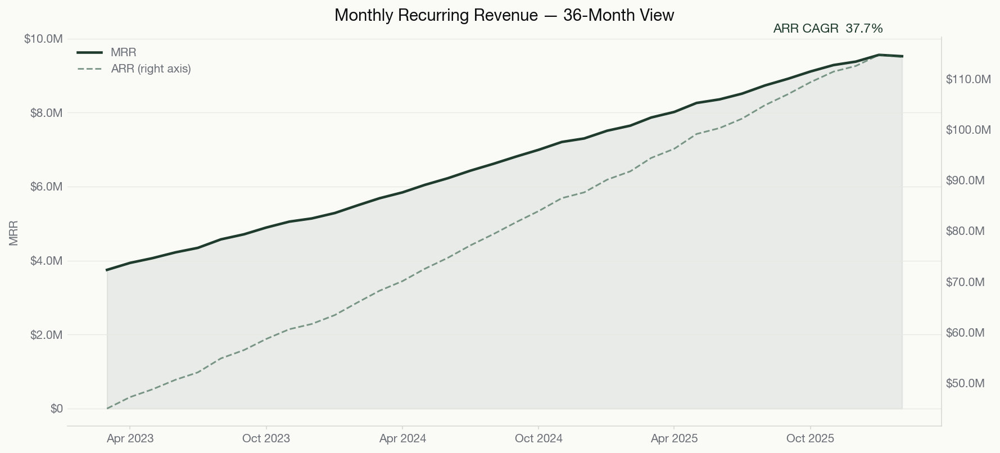

# B2B SaaS Revenue Quality & Churn Early Warning

A reproducible Python and SQL analytics system for testing whether B2B SaaS recurring-revenue growth is **durable or discount-financed**, then prioritising accounts with elevated churn risk.

**[Open the live dashboard](https://mfidalgomartins.github.io/b2b-saas-revenue-quality-churn-os/)** · **[Read the analytical report](outputs/reports/revenue_quality_os_analytical_report.pdf)**



---

## Analytical scope

The seeded simulation covers **4,500 accounts across 36 monthly periods from March 2023 to February 2026**. The pipeline runs synthetic data generation, schema validation, feature engineering, interpretable scoring, forward-outcome calibration, scenario forecasting, chart and PDF generation, and a self-contained executive dashboard.

Topline MRR can grow while discount creep, usage decay, payment slippage, and fragile expansion weaken the book. Every score in this repository is traceable to documented fields and formulas so the resulting intervention queue can be audited.

## What's inside

| Layer | What it does |
|---|---|
| `src/data_generation/` | Generates 6 raw CSVs with seeded RNG. Deterministic for `--seed 42`. |
| `src/features/` | Builds the analytical layer: account-month revenue quality, customer health features, cohort retention summaries, account risk base. Schema-validated at the boundary. |
| `src/scoring/` | Four interpretable 0–100 scores — churn risk, revenue quality, discount dependency, expansion quality — composed into a governance priority. Single source of truth for weights **and component formulas** in `scoring_utils.py`. |
| `src/scoring/backtest_scoring_calibration.py` | Reconstructs every historical month's score with the production formulas and measures forward-3M churn by tier. A parity test detects drift against the latest production score. |
| `src/scoring/run_weight_sensitivity.py` | ±20% weight perturbation report. Quantifies how stable tier assignments are. |
| `src/forecasting/` | MRR scenario trajectories — base, downside, upside, discount-discipline, risk-adjusted. |
| `src/visualization/` + `src/dashboard/` | 16 presentation-ready graphs and a self-contained HTML dashboard. |
| `scripts/build_pdf_report.py` | Builds the 31-page analytical report from the same processed tables and graph pack. |
| `src/validation/` | 21 governance checks (row counts, nulls, duplicates, leakage, calibration monotonicity, …) feeding a publication-readiness gate. |
| `sql/marts/` | SQL mirror of the Python semantic layer for warehouse consumers. |

## Headline results (seed 42)

| Metric | Value |
|---|---|
| Accounts modelled | 4,500 over 36 months |
| Annual run-rate (latest) | $114.3M |
| ARR CAGR over window | 37.7% |
| Net Revenue Retention (NRR) | 99.8% |
| Gross Revenue Retention (GRR) | 99.2% |
| Discount-reliant MRR | 15.9% |
| Backtest forward-3M churn — Low / Moderate / High | 2.3% / 6.1% / 18.9% |
| Weight sensitivity — max tier flips under ±20% perturbation | 5.3% |
| Governance gate | 21 / 21 PASS · readiness `technically valid` |

The roughly 8× lift between Low- and High-tier forward churn is the main calibration result for the rule-based score.

## Run it

```bash
python -m venv .venv
source .venv/bin/activate
python -m pip install -e ".[dev]"
python src/pipeline/run_project_pipeline.py --base-dir . --seed 42
```

Stages: `generate → profile → features → score → backtest → sensitivity → analyze → forecast → graphs → dashboard → validate → gate → report`.

Strict release gate (used in CI):

```bash
python src/validation/check_validation_gate.py \
  --summary-path reports/formal_validation_summary.json \
  --max-warn 0 --max-fail 0 \
  --max-high-severity 0 --max-critical-severity 0 \
  --min-readiness-tier "technically valid"
```

## Quality gates

Everything below is enforced by `make qa` and by CI on every push and pull request — none of it is "run it by hand if you remember".

| Gate | Command | Bar |
|---|---|---|
| Lint | `make lint` | Ruff `E,F,I,B,UP,SIM,C4`, clean |
| Format | `make format-check` | Ruff formatter, no diff |
| Coverage | `make coverage` | **100% branch coverage** of the pure-logic core library (`fail_under = 100`) |
| Static security | `make security` | Bandit, no findings (subprocess/`git` patterns reviewed and documented) |
| Dependency audit | `make audit` | `pip-audit`, no known CVEs in declared dependencies |
| Governance gate | `make gate` | 0 WARN / 0 FAIL / 0 high / 0 critical, `technically valid` |
| Performance | `make benchmark` | Backtest hotspot benchmark; see [`docs/core/performance.md`](docs/core/performance.md) |

Coverage is measured over the modules unit tests import directly (`metrics`, `scoring_utils`, `io/*`,
the validation gate, `dashboard_contract`); the end-to-end pipeline scripts are exercised by the integration
build (`make all`) and the artifact-contract suite. See [`CONTRIBUTING.md`](CONTRIBUTING.md) for the full
workflow and [`SECURITY.md`](SECURITY.md) for the security posture.

## Decisions this supports

- **Renewal triage** — which accounts need intervention now, ranked by governance priority.
- **Discount discipline** — how much ARR is bought with sub-economic pricing, and where it concentrates.
- **Expansion quality** — separates genuine seat / usage expansion from price-led churn-in-disguise.
- **Forecast realism** — bridges current-state metrics to forward MRR scenarios with explicit assumptions.

## Design choices

- **Rule-based, not ML.** Every score is a weighted sum of normalised components defined in `scoring_utils.py`.
- **One source of truth for scoring math.** All four score families compose from `compute_*_components` functions and weight dicts in `scoring_utils.py`; the production scorer and calibration backtest import the same definitions, so they cannot drift. Unit tests assert weights sum to 1 and pin each component family.
- **Schema contracts at load boundaries.** `src/io/contracts.py` rejects malformed inputs before they propagate.
- **Beginning-base retention.** GRR, NRR, revenue churn, and logo churn exclude new logos and use reconstructed beginning-of-month denominators.
- **Validation gate.** 21 governance checks produce a readiness tier; the CLI gate fails CI on any regression in WARN / FAIL counts or severity counts.
- **Self-contained dashboard.** Charts are drawn inline as SVG from the embedded JSON payload. The HTML works offline and on GitHub Pages without a build step.

## Limitations

- Synthetic data by design. The pipeline shape is real; absolute numbers are illustrative.
- Rule-based scores are interpretable but not causal. Calibration uses the same synthetic data-generating environment and is not external validation.
- Scenario forecasts are assumption-driven operating ranges, not statistical forecasts.
- Churn-event months remain part of monthly revenue exposure; retention metrics explicitly remove churned MRR from the retained base.
- Single-tenant assumption: no multi-product overlap or cross-sell logic modelled.

## Repository layout

```
src/        analysis/  dashboard/  data_generation/  features/  forecasting/
            io/  pipeline/  profiling/  scoring/  validation/  visualization/
data/       raw/  processed/
docs/core/  feature_dictionary.md  methodology.md  scoring_model_design.md  …
outputs/    graphs/  dashboard/  reports/
reports/    profiling, business analysis, validation, backtest, sensitivity
sql/        staging/  marts/
tests/      unit, metric-integrity, and artifact-contract tests
```

## Tech

Python 3.12 · pandas · NumPy · Matplotlib · Seaborn · ReportLab · SQL · HTML / CSS / SVG / JS · Ruff · unittest · coverage.py · Bandit · pip-audit · GitHub Actions

Released under the [MIT License](LICENSE).

---

Built by [Miguel Fidalgo Martins](https://www.linkedin.com/in/miguel-fidalgo-martins/).
